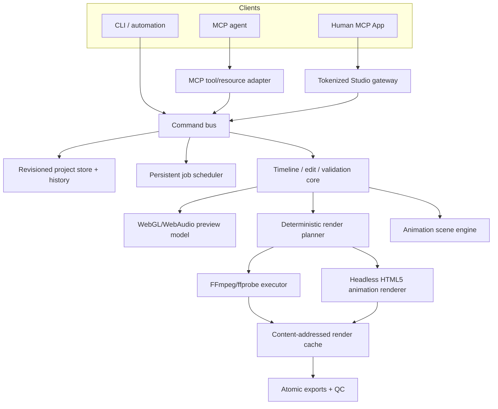

# Standalone MCP Video Studio: technical implementation plan

Status: proposed implementation plan for [FLUJO issue #367](https://github.com/mario-andreschak/FLUJO/issues/367), revised around the maintainer's [re-plan comment](https://github.com/mario-andreschak/FLUJO/issues/367#issuecomment-5288520481).

Target repository: `C:\Users\Moe\Documents\GitHub\mcp-video-studio`.

## Source-of-truth scope

The re-plan comment supersedes two major assumptions in the original epic:

1. This is a standalone product. It must not be pre-shipped, registered, migrated, version-pinned, or released as an internal FLUJO server.
2. The MCP App is a full editor for humans, not a limited scrub-and-approve surface.

The product is three layers in one:

- **High-level human editor:** a polished, accessible, Clipchamp-class MCP App with media management, preview, multi-track direct manipulation, titles/captions, transitions, effects, audio mixing, history, rendering, and export.
- **Mid-level video/audio API:** revision-safe tools for sequences, tracks, clips, images, cut/move/trim/split, time-stretch, transforms, transitions, custom audio, levels, EQ, effects, automation, captions, rendering, and QC. The App and agents use the same command layer.
- **Low-level animation engine:** a deterministic, Manim-like declarative scene/animation model plus a controlled custom-HTML5 clip protocol. Animation output becomes an ordinary clip that can be edited, mixed, and rendered on the main timeline.
- **Generated-content lifecycle:** provider-neutral narration, transcription/captions, music, and animation generation whose requests, immutable versions, review decisions, and active timeline bindings remain inspectable across UI reloads and new agent sessions.

This is intentionally a large implementation. The phases below create usable vertical slices without redefining “full editor” into a smaller product.

## Product definition

### The human workflow

A person can open the MCP App and complete a project without asking an agent to manipulate files or run commands:

1. Create/open a portable project.
2. Import video, audio, images, fonts, subtitles, and animation assets.
3. Organize media in bins and inspect metadata, thumbnails, proxies, and waveforms.
4. Drag media onto an ordered multi-track timeline.
5. Select, move, trim, split, slip, duplicate, group, link, ripple, snap, and reorder clips.
6. Add transitions, transforms, crop/mask/blend operations, text/titles, captions, video effects, audio effects, automation, and speed changes.
7. Preview in real time at an adaptive proxy resolution.
8. Mix audio with meters, waveforms, per-clip/track levels, pan, fades, EQ, dynamics, and ducking.
9. Create or edit deterministic HTML5/declarative animation clips and place them on the same timeline.
10. Undo/redo reliably, autosave, recover after a crash, run QC, render, and export.

### The agent workflow

An agent can perform the same work without coordinates or UI automation:

1. Inspect project/sequence/media summaries.
2. Apply one typed timeline transaction against an expected revision.
3. Import or relink assets by path/hash.
4. Create and edit animation documents through structured operations.
5. Request proxies, thumbnails, waveforms, renders, exports, and QC jobs.
6. Poll or subscribe to job/project resources, cancel work, and recover conflicts.
7. Inspect generated-artifact provenance and review state, regenerate a bounded artifact or time range, compare versions, and explicitly activate or approve a result without losing downstream timeline edits.

### The review and revision workflow

Generated media is not a one-shot side effect. A human or model can return in a later session and understand what exists, why it exists, and what may safely change:

1. Select a timeline range, clip, caption group, animation, narration passage, or music bed.
2. Create a generation request with explicit provider/model/voice, prompt or source, seed where supported, and the source project revision.
3. Persist the request immediately as a queued immutable version, then run provider work as a resumable background job.
4. Attach the resulting media/captions/animation as a draft version while preserving the existing active version and all clip-level timing, transforms, effects, automation, and mix decisions.
5. Review the draft in the normal program monitor, optionally compare it with the active/approved version, add notes, reject it, or activate it.
6. Regenerate only the artifact or selected time range. A new version links to its parent and never overwrites prior output.
7. Approve an active version. Approval records the reviewer, timestamp, project revision, and optional note; it does not prevent a later draft from being generated.

Fine-grained timeline edits remain ordinary typed commands. “Different music here,” “change this sentence,” “lower dialogue by 3 dB from this tick to that tick,” and “add a filter to this clip” therefore do not require rerunning an opaque whole-project prompt.

### Non-goals for the first stable release

These exclusions protect the editor architecture without shrinking the requested three layers:

- collaborative cloud editing or multi-user operational transform;
- cloud media storage, stock-media licensing, publishing to social networks, or hosted rendering;
- music composition/DAW sequencing beyond editing and mixing imported/generated audio;
- arbitrary native plugins or VST hosting in-process;
- professional color-management certification, HDR mastering, or broadcast interchange formats in v1;
- mobile phone editing; the App is desktop-first but responsive enough to inspect projects on small screens.

Nested sequences, compound clips, multicam, tracking, stabilization, noise removal, and background removal belong in the architecture from the start but can ship after the core v1 feature gate.

## Layered architecture



### One command bus

The App must not implement a private editing engine and MCP tools must not mutate JSON directly.

Every state change becomes a typed command handled by one core command bus:

```ts
type ProjectCommand =
  | { type: "track.add"; sequenceId: string; track: NewTrack }
  | { type: "clip.add"; trackId: string; clip: NewClip; mode: InsertMode }
  | { type: "clip.move"; clipIds: string[]; targetTrackId: string; startTick: number; ripple: boolean }
  | { type: "clip.trim"; clipId: string; edge: "in" | "out"; tick: number; ripple: boolean }
  | { type: "clip.split"; clipId: string; atTick: number }
  | { type: "effect.add"; owner: OwnerRef; effect: NewEffect }
  | { type: "automation.set"; lane: AutomationLane }
  | { type: "animation.apply"; animationId: string; operations: AnimationOperation[] }
  | /* remaining typed commands */;
```

The command handler:

1. acquires the project write lock;
2. reloads and checks `expectedRevision`;
3. validates the command and affected timeline region;
4. applies it to an immutable draft;
5. validates the resulting project;
6. records forward and inverse operations in the history journal;
7. increments the revision once;
8. atomically persists the document; and
9. publishes a compact change event.

MCP tools, Studio gateway endpoints, keyboard shortcuts, drag gestures, undo, redo, and CLI commands all call this same layer.

### Universal integer timebase

A full video/audio editor cannot use floating-point seconds or video frames as its only authored time coordinate. Video must remain frame-exact while audio must remain sample-exact.

Use a fixed project timebase of **35,280,000 ticks per second**:

- divisible by 24, 25, 30, 50, and 60 fps frame durations;
- exact for 24000/1001 and 30000/1001 frame durations;
- divisible by both 44.1 kHz and 48 kHz sample periods; and
- safe in JavaScript integers for projects far longer than the supported maximum duration.

Persist `startTick`, `durationTick`, and `sourceInTick`. API boundaries accept timecode, frames, samples, ticks, or seconds and convert once. UI calculations use ticks and only format seconds/timecode for display.

Project validation rejects values that are not aligned to the relevant video frame or audio sample grid when an operation requires exact alignment.

### Revisioning, undo, autosave, and crash recovery

- Every mutation requires `expectedRevision`; a mismatch returns a structured conflict and never applies last-write-wins.
- Project writes use a unique same-directory temporary file, flush, validate, then atomic rename.
- Each committed transaction records an inverse transaction in a checksummed append-only history journal.
- Undo/redo are server commands, not an in-memory React stack. They therefore work across App reloads and agent edits.
- Autosaves are bounded revision snapshots. Startup validates the current project and journal tail; if recovery is needed, it presents explicit candidates instead of silently creating a blank project.
- History compaction creates a new snapshot/checkpoint only after the current document and journal are both durable.

### Portable project bundle

```text
My Project.vstudio/
  project.json                 # authoritative authored state
  assets/                      # content-addressed imported media
    ab/cd/<sha256>.<ext>
  fonts/                       # explicitly imported/licensed project fonts
  proxies/                     # derived, disposable preview media
  cache/                       # derived render nodes and animation intermediates
  history/                     # transaction journal + bounded checkpoints
  jobs/                        # resumable job metadata and logs
  exports/                     # user deliverables; never auto-evicted
```

Asset references use SHA-256 plus metadata. Base64 media never enters `project.json`. External linked media is supported, but the project records its last known hash/size/mtime and exposes a relink/consolidate workflow before export.

### Render planner, not model-authored commands

The renderer compiles the project into a deterministic DAG:

1. probe and validate sources;
2. generate/reuse proxies, thumbnails, waveforms, and normalized intermediates;
3. render animation clips to frame-exact lossless video;
4. trim, time-map, transform, composite, transition, and effect video layers;
5. render titles/captions/overlays;
6. time-map, effect, automate, and mix audio tracks;
7. mux a review master;
8. encode the selected export preset;
9. verify decode/container/timing/loudness/QC; and
10. atomically publish the deliverable.

Every DAG node has a cache key from canonical parameters, input hashes, renderer/effect versions, and relevant runtime versions. A project change invalidates only affected nodes and downstream assembly.

No normal tool accepts a filtergraph or command string. The renderer may generate FFmpeg filter-complex script files internally. A diagnostic `raw_ffmpeg` escape hatch, if retained at all, is admin-only and hidden from the default model tool surface.

### Preview/final-render relationship

Real-time preview and final export have different performance constraints but must share semantics:

- `@studio/core` owns time mapping, transforms, crop/mask geometry, blend/effect parameters, easing, automation, transitions, and text layout inputs.
- The App compiles that model to WebGL2/Canvas and WebAudio/AudioWorklet for interactive preview.
- Final video compiles the same model to typed FFmpeg operations and cached HTML-animation intermediates.
- Effects with no proven real-time equivalent use a rendered preview proxy instead of pretending an approximation is exact.
- Contract fixtures sample both engines at fixed ticks and compare geometry, colors, alpha, effect values, audio gain, and bounded pixel/audio differences.

This avoids two unrelated creative engines while allowing FFmpeg to remain the scalable final renderer.

### Direct generation providers and MCP's role

MCP remains the external control plane: a host model inspects the project and calls the same typed tools as the Studio. The server must not depend on MCP Sampling for product-critical generation. The 2026 MCP direction deprecates Sampling in favor of direct provider integration, and client support has never been uniform enough to make it the persistence or job-execution layer.

The server owns a small provider registry with capability-specific interfaces:

```ts
interface LanguageProvider {
  completeJson<T>(request: StructuredCompletionRequest<T>): Promise<ProviderResult<T>>;
}
interface SpeechProvider {
  synthesize(request: SpeechRequest): Promise<BinaryProviderResult>;
}
interface TranscriptionProvider {
  transcribe(request: TranscriptionRequest): Promise<TranscriptProviderResult>;
}
interface MusicProvider {
  compose(request: MusicRequest): Promise<BinaryProviderResult>;
}
```

Initial adapters:

- **OpenAI-compatible language adapter:** configurable `baseUrl`, API-key environment variable, model, and protocol (`responses` or `chat_completions`). This is used for bounded structured artifacts such as animation documents or caption rewrites, not as an unbounded hidden agent loop.
- **OpenAI audio adapter:** speech synthesis and transcription using the configured OpenAI-compatible base URL and explicit models.
- **ElevenLabs adapter:** narration/TTS, Scribe transcription, and Music composition with explicit voice/model/output-format settings.
- **Imported/local adapter:** registers externally produced files or human recordings in the exact same lifecycle, so provider choice never leaks into timeline semantics.

Provider credentials are process configuration or an OS/keychain-backed secret reference; API keys are never written to `project.json`, history, job results, logs, MCP responses, or browser storage. Provider status exposed to Studio is redacted to capability, endpoint origin, configured model, and whether a credential exists.

The OpenAI-compatible language call may return a validated command proposal or a single structured artifact. The server performs the tool loop itself when one is needed: validate proposal, execute the shared command handler, feed back bounded structured results, and stop at explicit iteration/cost limits. This works in Studio, CLI, and MCP sessions alike and does not require an MCP client to support nested Sampling or tools.

### Generated artifact and version model

`project.json` stores lightweight lifecycle records while binary outputs remain managed media assets:

```ts
interface GeneratedArtifact {
  id: string;
  kind: "narration" | "music" | "captions" | "animation";
  name: string;
  scope: { sequenceId: string; trackId?: string; clipId?: string; startTick: number; durationTick: number };
  activeVersionId?: string;
  approvedVersionId?: string;
  versions: GeneratedArtifactVersion[];
}

interface GeneratedArtifactVersion {
  id: string;
  parentVersionId?: string;
  status: "queued" | "generating" | "draft" | "approved" | "rejected" | "failed" | "superseded";
  request: GenerationRequest;
  output?: { mediaId?: string; animationId?: string; captions?: CaptionCue[] };
  provenance: { provider: string; model: string; requestHash: string; sourceRevision: number; requestId?: string };
  createdAt: string;
  review?: { reviewer: string; reviewedAt: string; note?: string };
  error?: StudioError;
}
```

Activating an audio or animation version swaps only the referenced clip source and deliberately preserves its clip identity, placement, trim, playback rate, transform, effects, automation targets, and mix settings. Activating captions replaces only the artifact-owned cue set. Old generated media stays content-addressed and recoverable until explicit project cleanup.

### Standalone MCP App delivery

The full editor bundle will exceed hosts' small inline `ui://` resource limits. Use the proven bootstrap/gateway pattern:

- `ui://video-studio/app-v1.html` is a tiny self-contained MCP App shell below 2 MiB.
- The server starts a loopback-only Studio gateway with an ephemeral bearer token.
- The shell frames the full SPA served from the gateway origin; the resource metadata grants only that origin in `frameDomains`.
- The token is injected into the shell/resource and never returned in model-visible tool content.
- The gateway serves the SPA, range-enabled media/proxy endpoints, thumbnails, waveform tiles, project change events, job progress, and low-latency command endpoints.
- Gateway endpoints call the same command bus as MCP tools; they never edit project files directly.
- Local stdio is the primary deployment. Remote Streamable HTTP deployment requires an explicitly configured reachable `publicOrigin`, TLS, and authentication; it must not advertise an unusable loopback origin.
- If the gateway cannot start, the tool returns diagnostics rather than opening a broken blank App.

### Standalone package and transports

Publish one standalone package and CLI, tentatively:

- npm package: `mcp-video-studio`;
- MCP registry name: `io.github.flujo-app/mcp-video-studio`;
- executable: `mcp-video-studio`;
- default command: `mcp-video-studio --stdio`;
- development/remote option: `mcp-video-studio --http --port <port>`; and
- diagnostics: `mcp-video-studio doctor`.

FLUJO receives only documentation showing how to install/configure this external server. There are no changes to FLUJO's `mcp-servers/`, shipped descriptors, migrations, release scripts, or Docker image.

## Project document

The raw schema is versioned JSON Schema and generated TypeScript types. This sketch fixes the important model.

```json
{
  "schemaVersion": 1,
  "projectId": "uuid",
  "revision": 42,
  "name": "Launch film",
  "timebase": 35280000,
  "settings": {
    "fps": { "numerator": 30000, "denominator": 1001 },
    "raster": { "width": 1920, "height": 1080 },
    "sampleRate": 48000,
    "channels": 2,
    "colorSpace": "rec709",
    "background": "#000000"
  },
  "media": [
    {
      "id": "media-1",
      "kind": "video",
      "storage": { "mode": "managed", "sha256": "...", "relativePath": "assets/ab/cd/...mp4" },
      "probe": { "durationTick": 352800000, "hasVideo": true, "hasAudio": true }
    }
  ],
  "sequences": [
    {
      "id": "main",
      "name": "Main sequence",
      "tracks": [
        { "id": "v2", "type": "video", "name": "Titles", "order": 2, "locked": false, "muted": false },
        { "id": "v1", "type": "video", "name": "Video 1", "order": 1, "locked": false, "muted": false },
        { "id": "a1", "type": "audio", "name": "Dialogue", "order": 1, "locked": false, "muted": false },
        { "id": "c1", "type": "caption", "name": "English", "order": 1, "locked": false, "muted": false }
      ],
      "clips": [
        {
          "id": "clip-1",
          "trackId": "v1",
          "source": { "type": "media", "mediaId": "media-1" },
          "startTick": 0,
          "durationTick": 105840000,
          "sourceInTick": 35280000,
          "playbackRate": { "numerator": 1, "denominator": 1 },
          "transform": { "position": [0.5, 0.5], "scale": [1, 1], "rotation": 0, "anchor": [0.5, 0.5], "opacity": 1 },
          "effects": [],
          "audio": { "gainDb": 0, "pan": 0, "muted": false, "effects": [] },
          "linkedGroupId": "av-link-1"
        }
      ],
      "transitions": [],
      "automation": [],
      "markers": []
    }
  ],
  "animations": [],
  "exportPresets": [],
  "activeSequenceId": "main"
}
```

### Timeline invariants

- IDs are stable and unique.
- Tracks have a deterministic compositing/mix order.
- Locked tracks reject edits.
- Video/overlay tracks may overlap and composite; a same-track overlap is legal only when its resolution is deterministic (explicit layering order or a transition).
- Audio tracks may overlap freely and are mixed.
- Clip duration/source mapping is positive and within source bounds unless the source explicitly supports hold/loop behavior.
- Splitting preserves source mapping, effects, automation, and AV links on both resulting clips.
- Ripple operations shift only the declared scope and never locked tracks.
- Transition duration cannot exceed available handles on either clip.
- Effect and automation parameters come from registered schemas and bounded ranges.
- Project FPS/raster/sample-rate changes run a migration command that reports every snapping/resampling consequence before commit.

## Low-level animation document

Animation is a first-class media source, not arbitrary code hidden in an effect field.

```json
{
  "schemaVersion": 1,
  "id": "anim-1",
  "name": "Feature diagram",
  "durationTick": 105840000,
  "canvas": { "width": 1920, "height": 1080, "background": "transparent" },
  "seed": 12345,
  "nodes": [
    {
      "id": "title",
      "type": "text",
      "text": "One workflow",
      "style": { "fontAssetId": "font-1", "fontSize": 96, "fill": "#ffffff" },
      "transform": { "position": [960, 540], "scale": [1, 1], "rotation": 0, "opacity": 1 }
    }
  ],
  "animations": [
    { "type": "write", "target": "title", "startTick": 0, "durationTick": 35280000, "easing": "easeOutExpo" },
    { "type": "transform", "target": "title", "startTick": 35280000, "durationTick": 35280000, "to": { "position": [960, 300] } }
  ]
}
```

### Declarative animation capabilities

- Nodes: group, text, rich text, rectangle, ellipse, line, SVG/path, image, video, gradient, mask, camera, chart, particle emitter, and nested composition.
- Manim-like operations: create/draw, write, fade, transform, replace/morph, move-along-path, scale, rotate, focus/camera, stagger, indicate/pulse, and wait/hold.
- Keyframes: position, scale, rotation, anchor, opacity, crop/mask/path, color, text style, effect parameters, camera, and custom numeric properties.
- Easing: reviewed named curves plus bounded cubic Bezier input.
- Determinism: fixed frame time, seeded PRNG, disabled wall clock/network by default, fonts-ready barrier, stable color/raster, and exact frame count.

### Custom HTML5 animation clip

Advanced users/agents may import a self-contained HTML/CSS/JS bundle implementing a fixed protocol:

```ts
interface VideoStudioAnimation {
  prepare(context: { width: number; height: number; fps: Rational; durationTick: number; seed: number }): Promise<void>;
  renderFrame(context: { frame: number; tick: number; seconds: number }): void | Promise<void>;
  dispose?(): void | Promise<void>;
}
```

The runtime supplies deterministic `requestAnimationFrame`, clock, and seeded randomness. Network access, popups, navigation, downloads, and local filesystem access are denied by default. Local bundle assets are served from a confined content-addressed origin. A custom clip is rendered to a cached frame-exact lossless intermediate before main timeline composition.

## Public MCP surface

The model-facing surface should be explicit enough for reliable editing but small enough to understand. Batch transaction tools complement—not replace—the most common operations.

### Studio and diagnostics

- `open_studio({ projectPath? })`
- `doctor()`
- `list_projects()`
- `create_project({ path, name, settings })`
- `open_project({ path })`
- `get_project_summary({ projectId })`
- `get_sequence({ projectId, sequenceId, include? })`

### Media

- `import_media({ projectId, paths, storageMode })`
- `relink_media({ projectId, mediaId, path, expectedRevision })`
- `consolidate_media({ projectId, mediaIds?, expectedRevision })`
- `inspect_media({ projectId, mediaIds })`
- `create_proxies({ projectId, mediaIds, preset })`
- `extract_frames({ projectId, mediaId, times, layout? })`

### Timeline and tracks

- `add_track`, `update_track`, `remove_track`, `reorder_tracks`
- `add_clip`, `move_clips`, `trim_clip`, `split_clip`, `remove_clips`, `duplicate_clips`
- `group_clips`, `ungroup_clips`, `link_clips`, `unlink_clips`
- `set_clip_speed`, `set_clip_transform`, `set_clip_crop`, `set_clip_blend`
- `add_transition`, `update_transition`, `remove_transition`
- `add_marker`, `update_marker`, `remove_marker`
- `apply_timeline_transaction({ projectId, sequenceId, expectedRevision, commands[] })`
- `undo({ projectId, expectedRevision })`, `redo({ projectId, expectedRevision })`

Every movement/edit supports explicit insert behavior where relevant: `overwrite`, `insert`, `ripple`, or `replace`. Snapping is a client convenience; tools always send the exact resulting tick.

### Video, text, and captions

- `add_video_effect`, `update_video_effect`, `remove_video_effect`, `reorder_video_effects`
- `add_title`, `update_title`, `remove_title`
- `import_captions`, `add_caption`, `update_caption`, `remove_caption`, `export_captions`
- `set_automation_lane`, `remove_automation_lane`

### Audio

- `set_clip_audio`, `set_track_audio`
- `add_audio_effect`, `update_audio_effect`, `remove_audio_effect`, `reorder_audio_effects`
- `set_equalizer`, `set_fades`, `set_ducking`, `normalize_audio`
- `fit_audio_duration({ mode: "preservePitch" | "resample" })`

### Animation

- `create_animation_clip`
- `get_animation`
- `apply_animation_transaction`
- `add_animation_node`, `update_animation_node`, `remove_animation_node`
- `add_animation_operation`, `update_animation_operation`, `remove_animation_operation`
- `import_html_animation`
- `validate_animation`
- `render_animation_preview`

### Render, jobs, and QC

- `render_sequence({ projectId, sequenceId, preset, destination })`
- `render_selection({ projectId, sequenceId, range, preset })`
- `run_qc({ projectId, sequenceId, renderId?, profile })`
- `get_job({ jobId })`
- `cancel_job({ jobId })`
- `list_export_presets`, `save_export_preset`

Long operations return a persistent job ID immediately when the client supports asynchronous MCP Tasks; otherwise they use progress notifications and remain cancellable. Jobs are also resources so an App or agent can reconnect without losing state.

### Results and conflicts

Mutations return a compact delta, never the full project:

```json
{
  "success": true,
  "projectId": "...",
  "revision": 43,
  "transactionId": "...",
  "changed": {
    "sequences": ["main"],
    "tracks": ["v1"],
    "clips": ["clip-1", "clip-2"]
  },
  "warnings": []
}
```

A conflict is an expected structured error:

```json
{
  "success": false,
  "error": {
    "code": "REVISION_CONFLICT",
    "message": "Project revision changed.",
    "expectedRevision": 42,
    "actualRevision": 43
  }
}
```

## Initial effect and transition catalog

The architecture is registry-based; every effect has a schema, preview implementation, render compiler, serialization version, UI inspector, and parity fixtures.

### Video

- transform, crop, fit/fill, opacity, blend mode, corner radius, and masks;
- exposure, contrast, saturation, temperature/tint, highlights/shadows, and RGB curves;
- blur, sharpen, vignette, grain/noise, glow/bloom, drop shadow, and LUT;
- chroma key, luma key, and simple background color removal;
- freeze frame, reverse, speed, preserve-duration hold, and speed ramp;
- picture-in-picture and split-screen layout presets.

### Transitions

- cut, cross-dissolve, dip-to-color, wipe, slide, push, zoom, blur, whip, mask wipe, and match-cut helpers.

### Audio

- gain, pan, mute/solo, fade, equalizer, high/low-pass, compressor, limiter, gate, de-esser, delay, and reverb;
- loudness analysis/normalization, sidechain ducking, channel mapping, and peak meters;
- time stretch with pitch preservation through Rubber Band when available, chained `atempo` fallback in its valid range, and explicit resample mode when pitch change is desired.

Effects not available in the installed FFmpeg build are not advertised by `doctor`/the registry. Projects retain their configuration and report a missing-capability error rather than silently dropping an effect.

## Repository layout

Use npm workspaces for boundaries and testability while producing one installable package.

```text
mcp-video-studio/
  package.json
  package-lock.json
  tsconfig.base.json
  server.json
  README.md
  docs/
    architecture.md
    project-format.md
    animation-protocol.md
    effects.md
    host-setup.md
  packages/
    contracts/                  # JSON Schema, generated TS types, result contracts
    core/                       # project, timeline, commands, validation, history
    media/                      # assets, probe, proxies, thumbnails, waveforms
    renderer/                   # FFmpeg executor, render DAG, effects, QC, jobs
    animation/                  # declarative engine + headless HTML5 renderer
    server/                     # MCP stdio/HTTP, resources, gateway, CLI
    studio/                     # React MCP App and shared preview compositor
  tests/
    fixtures/                   # source text + generated-fixture recipes only
    integration/
    e2e/
```

Internal packages remain private. The root release bundles compiled server code, schemas, migrations, the small MCP App shell, and hashed Studio gateway assets into the published `mcp-video-studio` package.

## Phase 0 — foundation and executable specifications

### Work

1. Initialize the standalone repository, CI, formatting, lint, typecheck, test, build, pack, and release checks.
2. Create the workspace packages and dependency rules; `contracts` and `core` may not import UI/server/FFmpeg code.
3. Write versioned schemas for the project, sequence, media, clip, effect, automation, animation, transaction, job, and QC report.
4. Implement timebase/rational/timecode utilities with property-based tests.
5. Implement configuration and `doctor`: FFmpeg, ffprobe, Patchright/Chromium, filters/codecs, font support, Rubber Band, hardware encoders, scratch/cache roots, free-space floor, and write permissions.
6. Implement direct process spawning with argv arrays, `shell: false`, bounded logs, cancellation, process-tree cleanup, and stdout reserved for MCP.
7. Define the effect/transition registry interface, render node interface, command handler interface, and compatibility/version rules before feature implementations diverge.
8. Add generated 2–3 second media fixture recipes; do not commit large binaries.

### Exit gate

- `npm pack` installs into a clean directory and `mcp-video-studio doctor` plus stdio `tools/list` work on Windows and Ubuntu.
- Time conversions are exact for supported FPS/sample rates.
- The package remains entirely standalone; no FLUJO source file changes.

## Phase 1 — project store and media foundation

### Work

1. Implement portable project create/open/close, schema migrations, revision locks, atomic writes, checksummed transaction history, undo/redo, autosave, and recovery.
2. Implement confined path policy and data roots. All model/API paths are resolved and validated; symlink escapes are rejected.
3. Implement managed and linked asset modes, streaming SHA-256 import, dedupe, relink, consolidate, and offline/missing media reporting.
4. Implement typed ffprobe normalization and full-decode verification.
5. Implement thumbnail/contact-sheet generation, waveform peaks, audio loudness probe, proxy generation, and cache keys.
6. Implement range-enabled gateway media endpoints and authenticated resource URIs without base64-ing large media through MCP.
7. Implement persistent jobs, progress events, cancellation, cleanup, restart recovery, and disk-space admission checks.

### Tests

- concurrent revision conflict and retry;
- undo/redo across process restart;
- fault injection around project temp write/rename and journal append;
- missing/relinked/changed linked media;
- asset dedupe and hash mismatch;
- media range requests and bearer rejection;
- cancelled proxy generation leaves no published artifact or child process.

### Exit gate

- A project can safely import/relink media, generate viewable proxies/thumbnails/waveforms, survive restart/crash tests, and expose durable job state.

## Phase 2 — mid-level multi-track editing core

### Work

1. Implement sequences, ordered video/audio/overlay/caption tracks, clip types, markers, transitions, effects, and automation documents.
2. Implement add/move/trim/split/delete/duplicate/replace plus overwrite/insert/ripple modes.
3. Implement multi-select, group/ungroup, AV link/unlink, locked tracks, mute/solo/visibility, track reorder, and gap removal.
4. Implement slip, slide, roll, ripple trim, source handles, and exact source/timeline mapping.
5. Implement still-image and generated-color clips, loop/hold behavior, clip enable/disable, and nested-sequence schema support.
6. Implement transforms, crop, fit/fill, opacity, blend, clip/track effect stacks, and tick-based automation.
7. Expose explicit tools plus atomic multi-command transactions. Return compact deltas and change events.
8. Add render-plan invalidation analysis so an edit reports which proxies/render nodes became stale.

### Tests

- table/property tests for every edit mode and boundary;
- split followed by undo reproduces byte-identical project JSON;
- ripple respects locked tracks and declared scope;
- transition handles cannot overrun source media;
- linked AV edits preserve sync unless explicitly unlinked;
- 29.97 fps and 44.1/48 kHz operations remain grid-exact;
- concurrent App/agent changes conflict rather than overwrite.

### Exit gate

- The entire requested mid-level timeline can be built and modified through typed commands without editing JSON or writing FFmpeg commands.

## Phase 3 — first complete render vertical slice

### Work

1. Implement render DAG planning, cache lookup/publication, temp outputs, post-render validation, and atomic export.
2. Normalize source clips to project raster/FPS/pixel format/audio settings without mixed dynamic frame properties.
3. Render multi-track compositing, cuts, transforms, crop, opacity/blend, stills, and cross-dissolve.
4. Implement typed audio trim, gain, pan, fades, mix, loudness normalization, and mux.
5. Implement H.264/AAC MP4 review/export presets with faststart plus lossless FFV1 intermediates.
6. Implement preview proxy render of an arbitrary timeline range and cache only the affected segments.
7. Return complete provenance: project revision, render-plan hash, input hashes, runtime versions, node cache hits, command argv, duration/frames, and output SHA-256.

### Tests

- mixed source rasters/FPS/pixel formats;
- exact frame count and audio duration;
- real cross-dissolve without a dark gap;
- no probing of half-written outputs;
- one-clip change reuses unaffected cached nodes;
- deterministic lossless intermediate frame hashes;
- 30-second 1920×1080/30 fixture with H.264/AAC/faststart/full decode.

### Exit gate

- A multi-track project can be edited through Phase 2 commands and rendered to a correct deliverable without a raw filtergraph or shell.

## Phase 4 — full human editor shell and core interactions

This phase makes direct human editing a primary product surface, not a viewer added after the server.

### App layout

- media/project bin;
- source/program monitor;
- direct-manipulation multi-track timeline;
- toolbar and editing-mode controls;
- properties/effects inspector;
- audio meters/mixer panel;
- captions/text panel;
- animation panel;
- history/autosave/recovery panel;
- jobs/export/QC panel.

### Work

1. Implement the sub-2 MiB MCP App bootstrap and tokenized Studio gateway SPA.
2. Build virtualized tracks/clips for large timelines, zoom/scroll, playhead, in/out range, markers, time ruler, waveform/thumbnail tiles, and adaptive proxy playback.
3. Implement selection, marquee/multi-select, drag/move, trim handles, razor split, snapping, ripple/overwrite/insert modes, track reorder/resize, grouping, linking, and context menus.
4. Implement source/program monitor controls, jog/shuttle, frame stepping, loop, fit/fill, safe-area overlays, and before/after effect view.
5. Implement property inspectors for clip timing, transform/crop, opacity/blend, speed, transitions, effects, and automation/keyframes.
6. Implement undo/redo/history, optimistic command dispatch, conflict reconciliation, autosave state, offline media warnings, and crash-recovery UI.
7. Implement copy/paste/duplicate/delete, keyboard shortcuts, accessible focus order, screen-reader labels, non-pointer alternatives for drag edits, reduced motion, high contrast, and scalable type.
8. Implement App-to-model context summaries that include project/revision/selection without dumping the document or media.

### Tests

- Playwright component/e2e tests for pointer and keyboard versions of every core edit.
- Timeline virtualization and hit testing at multiple zoom/device scale settings.
- Drag conflict caused by an agent edit produces reload/reapply UI, not lost work.
- Undo/redo persists after closing/reopening the App.
- Gateway token/CSP/origin/range security tests.
- Axe/accessibility checks and a manual screen-reader/keyboard acceptance pass.

### Exit gate

- A human can import, arrange, cut, move, trim, transition, preview, undo, render, and export a multi-track project entirely in the MCP App.

## Phase 5 — production audio editing and mixing

### Work

1. Add custom audio import, dedicated audio tracks, clip/track mute/solo, gain, pan, fades, channel mapping, waveform editing, and peak/RMS/LUFS meters.
2. Implement ordered audio effect stacks: filters, four-band parametric EQ, compressor, limiter, gate, de-esser, delay, and reverb.
3. Implement tick/sample-aligned automation lanes for levels, pan, effect parameters, and music ducking.
4. Implement time-stretch/pitch modes, narration-to-slot fitting, speed ramps where supported, reverse audio, and resampling.
5. Build a mixer UI with accessible numeric controls plus draggable faders, meters, effect bypass/reorder, and automation visualization.
6. Compile final audio through generated FFmpeg filter scripts; preview through shared parameter models and AudioWorklets/WebAudio. Effects outside parity bounds use rendered preview stems.
7. Add dialogue/music/SFX mix-bus presets but keep every applied operation visible/editable.

### Tests

- impulse/frequency-response tests for EQ/filter parity;
- gain/pan/fade/automation sample-boundary tests;
- loudness/true-peak fixtures without stacked limiter damage;
- time-stretch duration and pitch fixtures;
- preview/final bounded-difference tests per effect;
- mute/solo/bus routing and AV sync through edits.

### Exit gate

- A human or agent can perform the requested custom-audio, levels, EQ, effects, time-stretch, ducking, mix, and loudness workflow without an external DAW for normal video production.

## Phase 6 — low-level animation engine

### Work

1. Implement the declarative animation schema, scene graph, pure tick-based evaluator, easing, keyframes, Manim-like operations, seeded randomness, and asset/font resolution.
2. Implement the shared browser preview runtime and editor inspectors for nodes, hierarchy, properties, keyframes, operation timing, camera, and background.
3. Implement structured animation MCP tools/transactions with the same revision/history semantics as timeline edits.
4. Implement the custom HTML5 bundle protocol, validator, sandbox, deterministic clock/PRNG, network policy, readiness barrier, fixed frame hook, and diagnostics.
5. Render animation clips headlessly to exact-frame transparent/lossless intermediates, cache by document/assets/runtime hash, and expose alpha-capable formats.
6. Treat animation as an ordinary timeline clip with trim, split, speed, transform, effects, transitions, audio, duplicate, and nested reuse.
7. Ship a reviewed preset/template library for titles, lower thirds, kinetic text, diagrams, charts, path drawing, particles, product callouts, and logo reveals—implemented with the same low-level engine.

### Tests

- deterministic evaluation across repeated runs and processes;
- exact start/mid/end values for every operation/easing;
- preview/headless pixel parity at sampled frames;
- alpha/color/font/path rendering;
- hostile custom HTML attempts at network, popup, navigation, filesystem, and nondeterministic clock access;
- animation clip cache invalidation and timeline trim/speed behavior.

### Exit gate

- An agent can build a non-trivial deterministic animation through structured tools, a human can edit it in the App, and the result behaves like any other clip on the main timeline.

## Phase 7 — effects, titles, captions, QC, and editor completeness

### Work

1. Complete the initial video/transition/audio registries and property inspectors.
2. Add rich titles, font import/management, templates, safe areas, text animation, SRT/VTT/ASS import/export, caption styling, and burn-in/sidecar export.
3. Add speed ramps, freeze/reverse, masks, LUT/color controls, chroma/luma key, picture-in-picture, split screen, and effect/transition preview proxies.
4. Implement structured QC: full decode, exact time/raster/FPS/codec, faststart, loudness/true peak, black/freeze/silence with allow-lists, caption coverage, missing/offline media, clipped audio, safe-area/text overflow, and render-plan provenance.
5. Present QC failures as time-linked timeline markers with evidence frames/contact sheets and one-click navigation.
6. Add export presets for web MP4, HEVC where available, WebM, GIF, audio-only, image sequence, and project archive. Hardware encoders are explicit presets with capability/fallback reporting.
7. Implement project archive/import with asset verification and schema migration preview.
8. Finish high-level workflows: favorites/templates, recent projects, relink/consolidate, replace media while preserving edits, render selection, background jobs, notifications, and export history.

### Exit gate

- The feature-completeness matrix below is implemented, tested, documented, and usable through both App and MCP command layers.

## Phase 8 — hardening and standalone release

### Work

1. Fuzz project/transaction schemas and media metadata parsers.
2. Test cancellation, crash, out-of-disk, corrupt media, lost linked media, killed Chromium, killed FFmpeg, and interrupted atomic publication.
3. Bound memory, subprocesses, Chromium workers, proxy/render concurrency, logs, histories, checkpoints, caches, and gateway connections.
4. Add Windows and Ubuntu release matrices; include macOS before claiming full platform support.
5. Run long-project performance tests and optimize timeline virtualization, waveform/thumbnail tiling, proxy seek, render-node reuse, and chunked animation rendering.
6. Security-review gateway tokens/CSP/origins, archive extraction, symlinks, custom HTML sandboxing, URL media, FFmpeg protocols, and path confinement.
7. Produce signed/checksummed release artifacts, npm provenance, MCP registry metadata, server.json, Docker example, and host setup docs for FLUJO/Codex/Claude Desktop/other MCP App hosts.
8. Run real human usability/accessibility sessions and agent task benchmarks; fix workflow defects before v1 rather than documenting them as quirks.

### Exit gate

- Clean install, doctor, App launch, agent edits, render, QC, export, update, and uninstall are reproducible from the standalone documentation.
- No FLUJO internal-server shipping change is part of release.

## Feature-completeness matrix for v1

| Area | Required v1 behavior |
| --- | --- |
| Projects | Create/open/recent, portable bundle, linked/managed assets, autosave, recovery, version migration, archive/import |
| Media bin | Video/audio/image/font/subtitle/animation import, folders/bins, metadata, search/sort, thumbnails, waveforms, proxies, relink/consolidate |
| Timeline | Multi-track, reorder/lock/mute/solo, add/move/trim/split/delete/duplicate, multi-select, group/link, snapping, overwrite/insert/ripple, gaps, markers, transitions |
| Clip editing | Source in/out, slip/slide/roll/ripple trim, speed/time stretch, freeze/reverse, transform/crop/opacity/blend, effect stack, automation |
| Preview | Adaptive proxy playback, frame step, jog/shuttle, loop/range, safe areas, before/after, rendered-preview fallback for expensive effects |
| Video | Core color/effects, masks/keying, picture-in-picture/layouts, titles/overlays, transition catalog |
| Audio | Custom tracks, waveforms, gain/pan/fades, mute/solo, meters, EQ, dynamics/effects, automation, ducking, loudness, pitch-preserving stretch |
| Text/captions | Rich titles, font assets, templates, caption import/edit/style/export/burn-in, safe-area/overflow checks |
| Animation | Declarative scene graph, Manim-like operations, keyframes/easing, HTML5 protocol, deterministic preview/render, timeline clip integration |
| History | Durable undo/redo, transaction log, autosave/checkpoints, conflict handling, crash recovery |
| Rendering | Cached DAG, range/full render, progress/cancel/resume metadata, atomic export, software/hardware presets, provenance |
| QC | Decode/delivery/timing/audio/black/freeze/silence/caption/layout/media/provenance checks with time-linked evidence |
| Accessibility | Keyboard-complete editing, labelled controls, focus management, non-drag alternatives, high contrast, reduced motion, scalable UI |

## Verification strategy

### Unit and property tests

- timebase/rational/timecode/frame/sample conversion;
- every timeline command and inverse;
- edit-mode boundary algebra;
- project schema migrations and canonical hashes;
- effect/transition/automation evaluation;
- render DAG invalidation and cache keys;
- FFmpeg argv/filter-script/concat/font escaping;
- detector/loudness/QC parsers;
- animation scene evaluation and deterministic PRNG.

### Integration tests

- real FFmpeg/ffprobe generated fixtures;
- real Patchright custom/declarative animation capture;
- stdio and Streamable HTTP MCP clients;
- project/gateway resources and range streaming;
- persistent jobs and cancellation;
- preview/final parity fixtures;
- package install from `npm pack` in a clean directory.

### App end-to-end tests

- create/import/edit/undo/render/export using pointer only;
- the same workflow using keyboard only;
- concurrent agent edit during a human drag/inspector edit;
- missing media/relink, crash recovery, out-of-disk, and cancelled render;
- large timeline virtualization and proxy playback;
- declarative and HTML5 animation creation/edit/render;
- accessibility automation plus manual assistive-technology pass.

### Required acceptance productions

1. **30-second promo regression:** exact 1920×1080/30 fps/900 frames, real transitions, HTML animation, titles/captions, VO+music mix, H.264/AAC faststart, structured QC PASS.
2. **Human editing benchmark:** an unfamiliar user imports provided media, assembles a multi-track one-minute edit, adjusts audio/EQ, adds titles/captions/animation, fixes a QC issue, and exports without terminal/agent assistance.
3. **Agent editing benchmark:** an agent constructs and revises the same project using MCP tools, including a revision conflict and targeted repair, without raw FFmpeg or JSON-file editing.
4. **Long project benchmark:** at least 30 minutes of mixed media with proxies and many clips; App remains responsive and a one-clip edit invalidates only the necessary render range.
5. **Animation benchmark:** a multi-scene diagram/product animation with SVG paths, morph/transform, kinetic text, camera motion, particles, and transparency matches preview at sampled frames.

## Security and resource controls

- Direct binary spawning only; no shell interpolation.
- Explicit allowed roots for projects/imports/exports/scratch; symlink-aware validation.
- FFmpeg network protocols disabled unless the caller imports a remote URL through an explicit download operation.
- Custom HTML network/navigation/popups/downloads/service workers denied by default.
- Gateway loopback-only by default, unguessable token, strict origin/CSP, range and request limits, idle shutdown.
- Archive import validates paths/sizes/counts before extraction and rejects traversal/symlinks.
- Atomic outputs are probed before publication; failed/cancelled jobs cannot replace an existing export.
- Disk admission checks before proxies/renders and bounded LRU eviction that never touches assets/history/exports.
- MCP responses return metadata, resource links, or bounded previews—not multi-megabyte base64 media by default.

## Rollout

The phases should be released as pre-1.0 standalone versions so real editing feedback arrives early without calling an incomplete slice “full feature”:

- `0.1`: foundation, doctor, project/media foundation;
- `0.2`: mid-level timeline command API;
- `0.3`: first end-to-end render slice;
- `0.4`: human MCP App core editor;
- `0.5`: production audio;
- `0.6`: animation engine;
- `0.7`: effects/titles/captions/QC completeness;
- `0.9`: hardened release candidate;
- `1.0`: feature matrix and acceptance productions complete.

Each release keeps schema migrations forward-compatible and records the minimum reader version. No phase modifies FLUJO to preinstall the package; users install it as an ordinary external MCP server throughout.

## Definition of done

The re-planned issue is complete when:

- the package is standalone and distributable without a FLUJO source change;
- the MCP App is a genuinely usable, accessible multi-track editor for humans—not a read-only approval view;
- all listed mid-level video/audio timeline operations are available through typed, revision-safe commands used by both App and agents;
- custom audio, levels, EQ, effects, time-stretch, automation, mix, render, and export are first-class;
- the deterministic declarative/HTML5 animation engine can create clips that edit and render like normal timeline media;
- preview and final output satisfy documented parity bounds and exact timing rules;
- undo/redo, autosave, conflicts, crash recovery, cancellation, cache eviction, and atomic exports survive failure testing;
- the acceptance productions pass through human and agent workflows without hand-authored filtergraphs, shell scripts, or direct project JSON edits; and
- FLUJO integration is documented as external MCP configuration only, never as a pre-shipped internal server.
